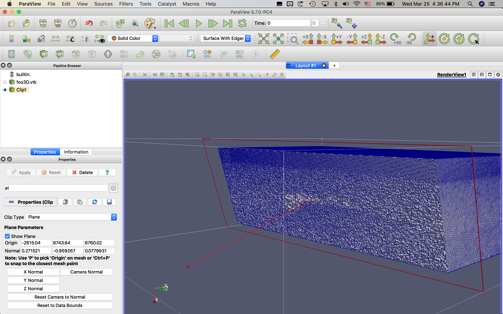

.. image:: https://circleci.com/gh/krober10nd/SeismicMesh/tree/parallel.svg?style=shield
        :target: https://circleci.com/gh/krober10nd/SeismicMesh/tree/parallel 

.. image:: https://codecov.io/gh/krober10nd/SeismicMesh/branch/parallel/graph/badge.svg
  	:target: https://codecov.io/gh/krober10nd/SeismicMesh
    
.. image:: https://img.shields.io/badge/code%20style-black-000000.svg
        :target: https://github.com/ambv/black

.. image:: http://www.repostatus.org/badges/latest/active.svg
	:alt: Project Status: Active – The project has reached a stable, usable state and is being actively developed.
	:target: http://www.repostatus.org/#active

SeismicMesh_: Mesh generation for Seismology in Python
==============================================
2D/3D triangular meshing for a slab of Earth based on modifications to the DistMesh_ algorithm. SeismicMesh is distributed under the GNU-GPL_ license.

.. _SeismicMesh: https://github.com/krober10nd/SeismicMesh
.. _DistMesh: http://persson.berkeley.edu/distmesh/
.. _`GNU-GPL`: http://www.gnu.org/copyleft/gpl.html

Installation :
==============================================

This software requires, a C++ compiler (GNU or Intel) with support for std++14, CMake >=3.0, CGAL >= 5.0 and Boost > 1.4.8. Once these packages are installed, you can run: 

1.  ``git submodule update --init --recursive``

2. ``pip install .``

If you do not have administrative rights on your system, use the flag ``--user`` 

1. ``git submodule update --init --recursive`` 

2. ``pip install --user .``

Notice the file ``Requirements.txt`` which indicates all the dependencies and their respective version numbers. If installing on a cluster with a local installation of ``CGAL`` and ``Boost``, you'll need to edit ``setup.py`` with the CMake arguments to point the installation to the correct directories. Namely, in ``setup.py`` you'll have to edit the list ``cmake_args`` to include:

``-DCMAKE_CXX_COMPILER=+/PATH/TO/CPPCOMPILER,``

``-DBoost_INCLUDE_DIR=+/PATH/TO/BOOST/``

``-DMPFR_LIBRARIES=+/PATH/TO/libmpfr.a``

``-DMPFR_INCLUDE_DIR=+/PATH/TO/MPFR/include,``

Testing:
==============================================
To run tests, install ``pytest``i.e., ``pip install pytest

1. ``cd tests/``
2. ``mpiexec -n 2 pytest .``

Gallery:
==============================================

