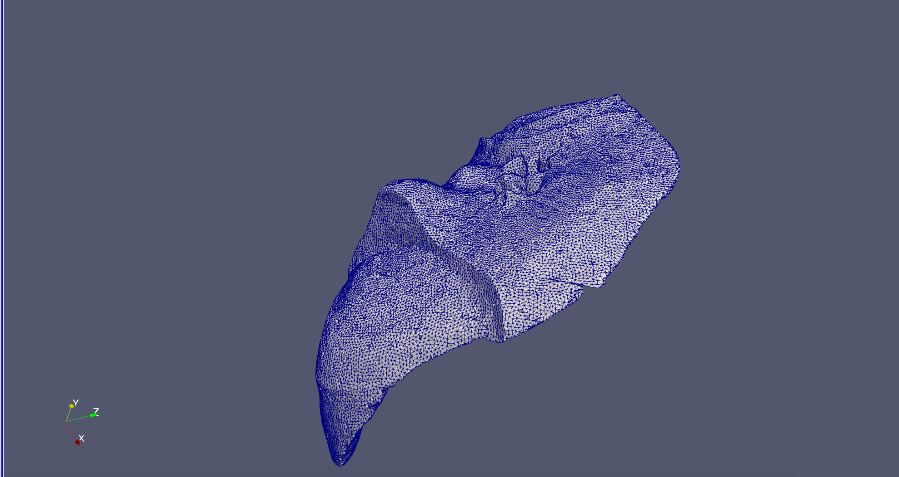

.. image:: https://circleci.com/gh/krober10nd/SeismicMesh/tree/parallel.svg?style=shield
        :target: https://circleci.com/gh/krober10nd/SeismicMesh/tree/par3d 

.. image:: https://codecov.io/gh/krober10nd/SeismicMesh/branch/par3d/graph/badge.svg
  	:target: https://codecov.io/gh/krober10nd/SeismicMesh
    
.. image:: https://img.shields.io/badge/code%20style-black-000000.svg
        :target: https://github.com/ambv/black

.. image:: http://www.repostatus.org/badges/latest/active.svg
	:target: http://www.repostatus.org/#active

.. image:: https://readthedocs.org/projects/seismicmesh/badge/?version=par3d
        :target: https://seismicmesh.readthedocs.io/en/par3d/?badge=par3d

SeismicMesh_: Mesh generation for Seismology in Python
==============================================
2D/3D triangular meshing for a slab of Earth based on modifications to the DistMesh_ algorithm. SeismicMesh is distributed under the BSD 2-Clause.

.. _SeismicMesh: https://github.com/krober10nd/SeismicMesh
.. _DistMesh: http://persson.berkeley.edu/distmesh/
.. _`GNU-GPL`: http://www.gnu.org/copyleft/gpl.html

Documentation
==============================================
Complete documentation including installation, theory, and tutorials is available here: 

https://seismicmesh.readthedocs.io

For practical examples, check out the scripts in the examples directory.

Gallery:
==============================================

.. image:: imgs/seismic_example.png

