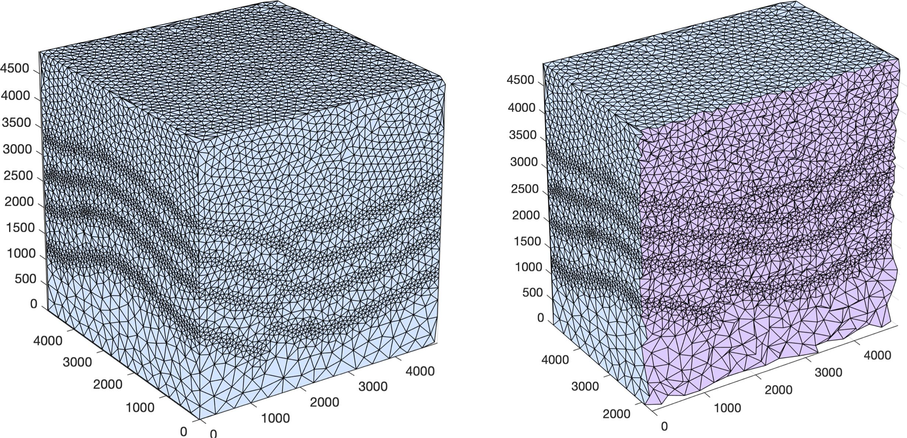
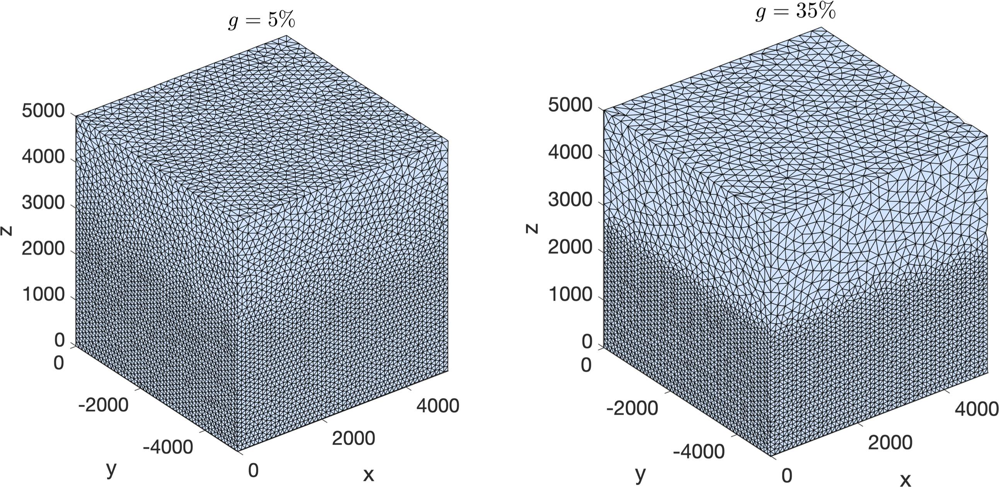
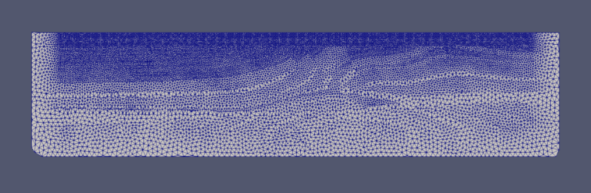

.. _tutorial:

.. warning::

    Under construction. Contributions very welcome!

Tutorial
========

*SeismicMesh* supports the generation of both 2D and 3D meshes in
either serial or parallel from seismic velocity models. It also supports the generation of
complex mesh sizing functions that are relevant to seismological applications.

Here I show how to build meshes from sizing functions created with the software and explain what the options mean. The API for serial/parallel and 2D/3D is identical.

Assuming you've coded a short Python script to call *SeismicMesh* (similar to what is shown in the examples), you simply call the script with python for serial execution::

    python your_script.py

Distributed memory parallelism can be used by first writing an extra import statement for  ``mpi4py`` (``import mpipy``) near your other imports and then writing the following one near the top of your script but after your other package imports and before you call the *SeismicMesh* API)::

    comm = MPI.COMM_WORLD

.. note::
   This line has no effect on serial execution and its fine to leave it in if you intend to only use serial execution.

Parallel execution takes place by typing by::

    mpiexec -n N python your_script.py

where `N` is the number of cores (e.g., 2,3,4 etc.)

.. warning::
    Oversubscribing the mesh generation problem to too many cores will surely lead to problems and slow downs. In general, keeping the minimum number of vertices per rank to between 20-50k/rank results in optimal performance.

Data for examples
-------------------

.. note::
    Users should create a directory called `velocity_models` and place their seismic velocity models there.

Data for this 2D tutorial can be downloaded for the BP2004 benchmark model::

    wget http://s3.amazonaws.com/open.source.geoscience/open_data/bpvelanal2004/vel_z6.25m_x12.5m_exact.segy.gz

and for the irregular free surface example here::

    wget http://s3.amazonaws.com/open.source.geoscience/open_data/bpmodel94/velocity.segy.gz

For more details about these two models, see the following link::

    https://wiki.seg.org/wiki/2004_BP_velocity_estimation_benchmark_model
    https://wiki.seg.org/wiki/1994_BP_migration_from_topography

The original data for the 3D example can be downloaded here::

    https://s3.amazonaws.com/open.source.geoscience/open_data/seg_eage_models_cd/Salt_Model_3D.tar.gz

For more details about this 3D data, see the following link: https://wiki.seg.org/wiki/SEG/EAGE_Salt_and_Overthrust_Models
See example_3D.py for how to read in the binary into a Numpy array.

File I/O and visualization of meshes
--------------------------------------

Meshes are written to disk in a variety of formats using the Python package `MeshIO` (https://pypi.org/project/meshio/). Note that *SeismicMesh* makes the assumption that the first dimension is `z` and the second is `x` while the third is `y`. This is done in this way since 2D seismological simulations take place in the z-x plane and 3D in the z-x-y plane. As a result, the meshes when loaded into visualization software will appear rotated 90 degrees. For visualization, we can output in the vtk format using MeshIO (as shown in the examples) and then load the vtk file into Paraview.

Some things to know
---------------------

.. warning ::
    In order to use these mesh sizing functions, it is assumed you have a seismic velocity model
    defined on a structured grid as was mentioned in the overview section.

This seismic velocity model is passed to the *MeshSizeFunction* class along with the domain extents ::

    from SeismicMesh import get_sizing_function_from_segy

    # Construct a mesh sizing function from a seismic velocity model
    ef = get_sizing_function_from_segy(fname, bbox, other-args-go-here,...)

* The user specifies the filename `fname` of the seismic velocity model (e.g., either SEG-y or binary)

* The user specifies the domain extents as a tuple of coordinates in meters representing the corners of the domain::

.. math::

    bbox = (z_{min}, z_{max}, x_{min}, x_{max})

* In 3D::

.. math::

    bbox = (z_{min}, z_{max}, x_{min}, x_{max}, y_{min}, y_{max})`

* If the user wants to define a mesh with an irregular boundary (other than a cube), then they will have to use the :class:`SignedDistanceFunctionGenerator` and pass a velocity interval range that represents the region of the domain they want meshed. See the section immediately below for instructions on how to create and use a custom signed distance function from a seismic velocity model.

Geometry
---------

*SeismicMesh* can mesh any domain defined by a signed distance function. We provide three basic domain shapes: a Rectangle, a Cube, or a Circle.

The user can build a rectangular 2D domain like so::

    from SeismicMesh import Rectangle, Cube, Circle

    rectangle = Rectangle(bbox)
    cube = Cube(bbox)
    circle = Circle(circle)

.. note::
    A good reference for various signed distance functions can be found [here](https://www.iquilezles.org/www/articles/distfunctions/distfunctions.htm)

Mesh size function
-------------------------------------------

Given a coordinate in :math:`R^n` where :math:`n= 2,3`, the sizing function returns the desired mesh size :mod:`h` near to that point. The mesh sizing capability provides is a convenience class that helps draft new meshes in a consistent and repeatable manner directly from available seismic velocity models. The sizing map is built on a Cartesian grid, which simplifies implementation details especially in regard to distributed memory parallelism. Furthermore, seismic velocity models are available on structured grids and thus the same grid can be used to build the sizing map on.

.. note:
    Seismic velocity models often have different constant grid spacings in each dimension. The software considers this automatically based on the domain extents.

The notion of an adequate mesh size is determined by a combination of the physics of acoustic/elastic wave propagation, the desired numerical accuracy of the solution (e.g., spatial polynomial order, timestepping method, etc.), and allowable computational cost of the model amongst other things. In the following sub-sections, each available mesh strategy is briefly described and psuedo code regarding how to call the :class:`MeshSizeFunction` class constructor.

.. note :: The final mesh size map is taken as the minimum of all supplied sizing functions.

Wavelength-to-gridscale
^^^^^^^^^^^^^^^^^^^^^^^
The highest frequency of the source wavelet :math:`f_{max}` and the smallest value of the velocity model :math:`v_{min}` define the shortest scale length of the problem since the shortest spatial wavelength :math:`\lambda_{min}` is equal to the :math:`\frac{v_{min}}{f_{max}}`. For marine domains, :math:`v_{min}` is approximately 1,484 m/s, which is the speed of sound in seawater, thus the finest mesh resolution is near the water layer.

The user is able to specify the number of vertices per wavelength :math:`\alpha_{wl}` the peak source frequency :math:`f_{max}`. This sizing heuristic also  can be used to take into account varying polynomial orders for finite elements. For instance if using quadratic P=2 elements, :math:`\alpha_{wl}` can be safely be set to 5 to avoid excessive dispersion and dissipation otherwise that would occur with P=1 elements::

   # Construct mesh sizing object from velocity model
   ef = get_sizing_function_from_segy(fname, bbox,
       wl=3, # :math:`\alpha_{wl}` number of grid points per wavelength
       freq=2, # maximum source frequency for which the wavelength is calculated
   )

Resolving seismic velocity gradients
^^^^^^^^^^^^^^^^^^^^^^^^^^^^^^^^^^^^^^^

Seismic domains are known for sharp gradients in material properties, such as seismic velocity. These sharp gradients lead to reflections and refractions in propagated waves, which are critical for successful imaging. Thus, finer mesh resolution can be deployed inversely proportional to the local standard deviation of P-wave velocity. The local standard deviation of seismic P-wave velocity is calculated in a sliding window around each point on the velocity model. The user chooses the mapping relationship between the local standard deviation of the seismic velocity model and the values of the corresponding mesh size nearby it. This parameter is referred to as the :math:`grad` and is specified in meters.
For instance a :math:`grad` of 50 would imply that the largest gradient in seismic P-wave velocity is mapped to a minimum resolution of 50-m.::

    ef = get_sizing_function_from_segy(fname, bbox,
        grad=50, # the desired mesh size in meters near the shaprest gradient in the domain
    )

.. note:

    The mapping of the local standard deviation of the gradient of seismic velocity is normalized to an interval of :math:`[0,1]` so that the largest gradient is assigned the mesh resolution indicated by :math`grad` and all other grad-to-mesh-sizes are associated using a linear relationship (with a slope of 1 and y-intercept of 0).

Courant-Friedrichs-Lewey (CFL) condition
^^^^^^^^^^^^^^^^^^^^^^^^^^^^^^^^^^^^^^^^^^^

Almost all numerical wave propagators utilize explicit time-stepping methods in the seismic domain. The major advantage for these explicit methods is computational speed. However, it is well-known that all explicit or semi-explicit methods require that the Courant number be bounded above by the Courant-Friedrichs-Lewey (CFL) condition. Ignoring this condition will lead to a numerically unstable simulation. Thus, we must ensure that the Courant number is indeed bounded for the overall mesh size function.

After sizing functions have been activated, a conservative maximum Courant number is enforced.

For the linear acoustic wave equation assuming isotropic mesh resolution, the CFL condition is commonly described by

.. math::

    C_{r}(x) = \frac{(\Delta t*v_p(x))}{dim*h(x)}

where :math:`h` is the diameter of the circumball that inscribes the element either calculated from :math:`f(h)` or from the actual mesh cells, :math:`dim` is the spatial dimension of the problem (2 or 3), :math:`\Delta t` is the intended simulation time step in seconds and :math:`v_p` is the local seismic P-wave velocity. The above equation can be rearranged to find the minimum mesh size possible for a given :math:`v_p` and :math:`\Delta t`, based on some user-defined value of :math:`Cr \leq 1`. If there are any violations of the CFL, they can bed edited before building the mesh so to satisfy that the maximum :math:`Cr` is less than some conservative threshold. We normally apply :math:`Cr = 0.5`, which provides a solid buffer but this can but this can be controlled by the user like the following::

    ef = get_sizing_function_from_segy(fname, bbox,
        cr=0.5, # maximum bounded Courant number to be bounded in the mesh sizing function
        dt=0.001, # for the given :math:`\Delta t` of 0.001 seconds
        ...
    )

Further, the space order of the method (:math:`p`) can also be incorporated into the above formula to consider the higher spatial order that the simulation will use::

    ef = get_sizing_function_from_segy(fname, bbox,
        cr=0.5, # maximum bounded Courant number :math:`Cr_{max}` in the mesh
        dt=0.001, # for the given :math:`\Delta t` of 0.001 seconds
        space_order = 2, # assume quadratic elements :math:`P=2`
        ...
    )

The above code implies that the mesh will be used in a simulation with :math:`P=2` quadratic elements, and thus will ensure the :math:`Cr_{max}` is divided by :math:`\frac{1}{space\_order}`

Mesh size gradation
^^^^^^^^^^^^^^^^^^^^^^^

In regions where there are sharp material contrasts, the variation in element size can become substantially large, especially using the aforementioned sizing strategies such as the wavelength-to-gridscale. Attempting to construct a mesh with such large spatial variations in mesh sizes would result in low-geometric quality elements that compromise the numerical stability of a model.

Thus, the final stage of the development of a mesh size function :math:`h(x)` involves ensuring a size smoothness limit, :math:`g` such that for any two points :math:`x_i`, :math:`x_j`, the local increase in size is bounded such as:

 :math:`h(\boldsymbol{x_j}) \leq h(\boldsymbol{x_i}) + \alpha_g||\boldsymbol{x_i}-\boldsymbol{x_j}||`

A smoothness criteria is necessary to produce a mesh that can simulate physical processes with a practical time step as sharp gradients in mesh resolution typically lead to highly skewed angles that result in poor numerical performance.

We adopt the method to smooth the mesh size function originally proposed by [grading]_. A smoother sizing function is congruent with a higher overall element quality but with more triangles in the mesh. Generally, setting :math:`0.2 \leq \alpha_g \leq 0.3` produces good results::

   ef = get_sizing_function_from_segy(fname, bbox,
       ...
       grade=0.15, # :math:`g` cell-to-cell size rate growth bound
       ...
   )

Domain extension
^^^^^^^^^^^^^^^^^^^

.. note::

    It is assumed that the top side of the domain represents the free-surface thus no domain extension is applied there.

In seismology applications, the goal is often to model the propagation of an elastic or acoustic wave through an infinite domain. However, this is obviously not possible so the domain is approximated by a finite region of space. This can lead to undesirable artificial reflections off the sides of the domain however. A common approach to avoid these artificial reflections is to extend the domain and enforce absorbing boundary conditions in this extension. In terms of meshing to take this under consideration, the user has the option to specify a domain extension of variable width on all three sides of the domain like so::

   ef = get_sizing_function_from_segy(fname, bbox,
       domain_extension=250, # domain will be extended by 250-m on all three sides
       ...
   )

In this domain extension region, mesh resolution can be adapted according to following three different styles.

 * ``Linear`` - extends the seismic velocities on the edges of the domain linearly into the domain extension.

 * ``Constant`` - places a constant velocity of the users selection in the domain extension.

 * ``Edge`` - extends the seismic velocity about the domain boundary so that velocity profile is identical to its edge values.

An example of the ``edge`` style is below::

   ef = get_sizing_function_from_segy(fname, bbox,
       domain_extension=250, # domain will be extended by 250-m on all three sides
       padstyle="edge", # velocity will be extends from values at the edges of the domain
       ...
   )

.. note::

    In our experience, the ``edge`` option works the best at reducing reflections with absorbing boundary conditions.

Mesh generation
-------------------------------------------

.. warning:
    Connectivity is made approximately deterministic as each instance of mesh generation uses
    the same ``seed=0``. The user can specify the seed if they like.

After building your signed distance function, call the ``generate_mesh`` function to generate the mesh::

    points, cells = generate_mesh(domain=domain, cell_size=ef, h0=hmin)

You can change how many iterations are performed by altering the kwarg `max_iter`::

    points, cells = generate_mesh(domain=domain, cell_size=ef, h0=hmin, max_iter=100)

.. note :: Generally setting max_iter to between 50 to 100 iterations works best. By default it runs 50 iterations.

When executing in parallel, the user can optionally choose which axis (0, 1, or 2 [if 3D]) to decompose the domain::

    points, cells = generate_mesh(domain=domain, cell_size=ef, h0=hmin, max_iter=100, axis=2)

Mesh improvement (*sliver* removal)
-------------------------------------------

3D *Sliver* removal
^^^^^^^^^^^^^^^^^^^^^^^

It is strongly encouraged to run the sliver removal method by passing the point of set of a previously generated mesh::

    points, cells = sliver_removal(
        points=points, domain=cube, h0=minimum_mesh_size,
    )

.. note:: Please remember to import this method at the top of your script (e.g., `from SeismicMesh import sliver_removal`)

 By default, ``min_dh_bound`` is set to :math:`10`. The sliver removal algorithm will attempt 50 iterations but will terminate earlier if no slivers are detected. Generally, if more than 50 meshing iterations were used to build the mesh, this algorithm will converge in 10-20 iterations.

.. warning:: Do not set the minimum dihedral angle bound greater than 15 unless you've already successfully ran the mesh with a lower threshold. Otherwise, the method will likely not converge.

References
______________

.. [grading] Persson, Per-Olof. "Mesh size functions for implicit geometries and PDE-based gradient limiting."
                Engineering with Computers 22.2 (2006): 95-109.
