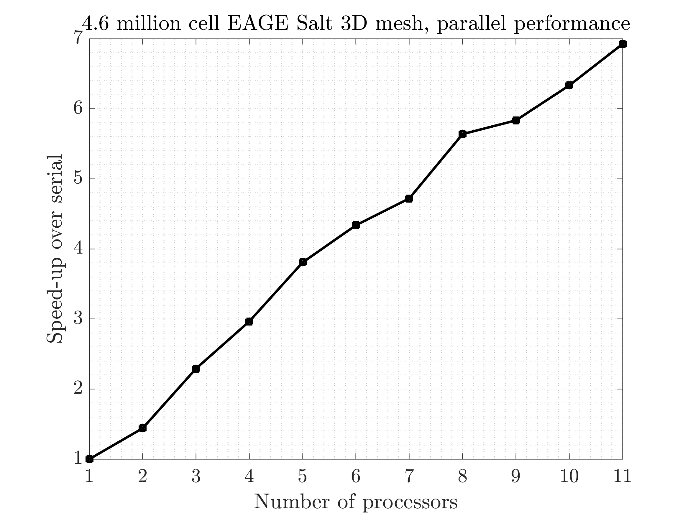

# Summary

`SeismicMesh` is a Python package for quality two and three dimensional triangular and tetrehedral
meshing directly from available seismic velocity models using signed distance functions. Low-level C++ code
is wrapped with Python for high performance at scale without losing flexibility or ease-of-use in
the user-interface. At a low level, the program makes direct calls to the Computational Geometry
Algorithms Library [@cgal:hs-chdt3-20a] to robustly and efficiently produce multiscale meshes.
For large scale problems the computationally expensive operations
are parallelized through modifications to a parallel Delaunay triangulation algorithm [@peterka2014high].
Mesh generation is accomplished through combined modifications to a smoothing-based mesh generation algorithm
known as `DistMesh` [@doi:10.1137/S0036144503429121].

# Background

Generating a high-quality graded mesh for a geophysical domain represents a modern
challenge for sophiscated geophysical simulation workflows. In these applications,
a geophysical domain is discretized typically with simplicial elements (e.g., triangles/tetrahedrals)
that vary in size around features of interest. These meshes are commonly used with Finite Element
Method (FEM) to solve Partial Differential Equation that model phyiscal processes such as
the acoustic or elastic wave equation. Geophysical exploration
studies use these meshes to solve inverse problems such as Full Waveform Inversion (FWI) [@doi:10.1190/1.1441754; @virieux2009overview]
and Reverse Time Migration (RTM) [@10.1093/gji/ggv380].

# Rationale

There are many aspects to consider when building a simplical mesh for a geophysical inverse problem
such as FWI or RTM, which make mesh generation for geophysical domains quite complex and time consuming.
Mesh elements must be sufficiently well-shaped, sized to maintain numerical stability, minimize numerical dissipatation,
and maximize physical representation accuracy. For applications such as FWI and RTM, material discontinuties
need to be well captured through fine resolution to ensure reflections are as accurate as possible
and domain extensions are used to absorb outgoing waves. In cases
with irregular free surface boundaries like in land-based surveys, explicit geometry of the boundary may not exist complicating
mesh generation workflows and requiring the use of graphical user interfaces to create these geometries.

Much like other popular mesh generators `gmsh` [@doi:10.1002/nme.2579] and `tetgen` [@si2015tetgen], `SeismicMesh` enables the generation of meshes through a script. However, there are two important and unique aspects to point about this work: first we provide a class to generate graded mesh sizing functions that control distribution of mesh sizes directly from seismic P-wave velocity models.
In this way, mesh resolution better resolves variations of material properties within the domain while ensuring numerical stability can stil be maintained and requiring little effort on part of the user. Secondly, mesh geometry is defined using set operations with signed distance functions which avoids
manual tracing or the use of graphical user interfaces to mesh 2D/3D geometrical features like irregular free surface boundaries and salt bodies.


# Functionality

The core functionality of `SeismicMesh` is as follows:

1. The creation of sophiscated 2D/3D graded mesh size functions on regular Cartesian grids using seismic velocity model data.

2. The generation of potentially large (> 10 million cells) quality triangular and tetrahedral meshes in either serial or with distributed parallelism according to the mesh sizing function distribution all using simple Python scripts.

3. An implementation of a 3D degenerate tetrehedral element removal technique [@tournois2009perturbing] to bound the minimum mesh quality while preserving domain features.


# Parallelism

Applications in FWI and RTM often require relatively high source frequencies (> 5 Hz) to produce high-resolution seismic velocity images. Typically, these models require a minimum number of vertices per wavelength (5-10) of the source wavelet to ensure numerical simulation have low dispersion errors. However, this quickly makes the generation of tetrehedral meshes prohibitively expensive in serial. For example, a 3D mesh of a popular 3D benhmark FWI model EAGE Salt [@doi:10.1190/1.1437283] requires blank cells when resolving a 2 Hz source frequency with 10 vertices per wavelength. For the same model discretized for source wavelet with a peak frequency of 4 Hz, the tetrahedral mesh increases by blank percent and becomes blank cells.

# Other potential applications


Figures can be included like this:

and referenced from text using \autoref{fig:example}.

Fenced code blocks are rendered with syntax highlighting:
```python
for n in range(10):
    yield f(n)
```

# Acknowledgements

Shell and Research Center for Gas Innovation

# References
