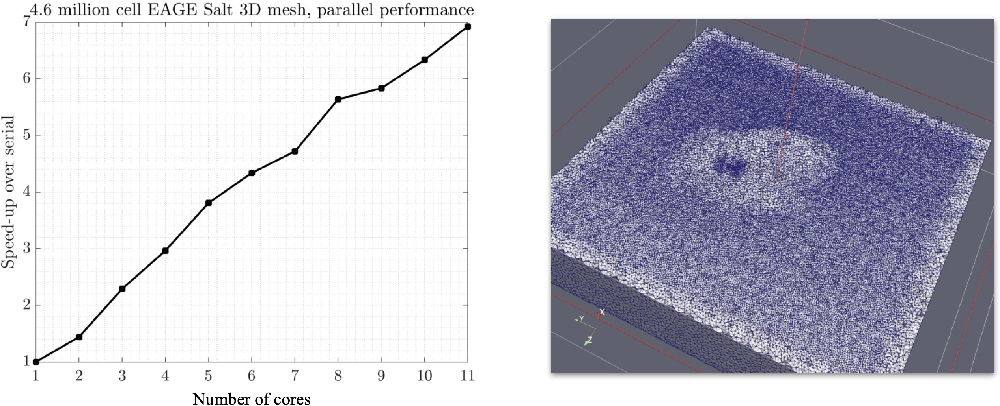

# Summary

`SeismicMesh` is a Python package for generating quality two and three dimensional simplical (triangular and tetrahedral)
meshes directly from seismic velocity models using signed distance functions. Low-level C++ code is wrapped with Python for high performance at scale without losing flexibility or ease-of-use. At a low level, the program makes direct calls to the Computational Geometry Algorithms Library [@cgal:hs-chdt3-20a] to robustly and efficiently produce efficient triangulations of a large quantity of points. Computationally expensive operations are parallelized through modifications to a parallel Delaunay triangulation algorithm [@peterka2014high], while mesh generation is accomplished through modifications to a smoothing-based mesh generation algorithm known as `DistMesh` [@doi:10.1137/S0036144503429121].

# Background

Generating a high-quality graded mesh for a geophysical domain represents a modern
challenge for sophisticated geophysical simulation workflows. In these applications,
a geophysical domain is discretized typically with simplicial elements (e.g., triangles/tetrahedral)
that vary in size around features of interest. These meshes are commonly used with Finite Element
Method (FEM) to solve Partial Differential Equation that model physical processes such as
the acoustic or elastic wave equation. Geophysical exploration
studies use these meshes as a discretization to solve inverse problems such as Full Waveform Inversion (FWI) [@doi:10.1190/1.1441754; @virieux2009overview]
and Reverse Time Migration (RTM) [@10.1093/gji/ggv380]. In these inverse problems, hundreds of forward and adjoint
simulations are required, which necessitates a mesh design that is robust, accurate, and efficient.

# Rationale

There are numerous aspects to consider when building a mesh for a geophysical inverse problem. Besides the commonly understood well-shaped geometric characteristics of elements that are necessary for simulation using the Finite Element Method, the distribution of elements should also accurately represent physical features that are relevant for the domain specific application. In applications such as FWI and RTM, material discontinuities need to be accurately resolved to ensure reflection and refraction of waves can be modeled accurately as compared to observed data. Special treatment is also required for building domain extensions that are used to absorb outgoing waves and minimize artificial boundary reflections. In domains with irregular free surface boundaries, explicit geometry data of the boundary surface may not exist requiring the use of external programs to create it. Therefore, besides the software containing capabilities to build the triangulation connectivity effectively, software should also be able to handle these domain specific aspects to facilitate automatic workflows from geophysical data direct to numerical simulation.

# Software architecture

Similar to other meshing programs such as `gmsh` [@doi:10.1002/nme.2579], `tetgen` [@si2015tetgen], and `mmg` [@mmg], `SeismicMesh` provides both generation and improvement of meshes through a scripting-based approach. However, one point of difference from the aforementioned software programs is a convenience class that is used to generate graded mesh sizing functions directly from geophysical datasets. Using this capability, mesh resolution can be efficiently distributed to resolve material variations within the interior of the domain while at the same time requiring little effort on part of the user.

In `SeismicMesh`, the domain geometry is defined by using set operations (e.g., union and intersection) with potentially several signed distance functions. This avoids the need to have explicit geometry information defining the boundary of the domain and enables more complex perhaps disjoint domains to be meshed. Further, a capability is provided to use isocontours of seismic velocity with the Fast Marching Method [@sethian1996fast] to create signed distance functions, which can then be used to mesh. Typically geometries such as the free surface, seafloor, and salt-bodies are characterized by pronounced faster or slower seismic velocities and thus these regions can be demarcated via a union or intersection of several signed distance functions each defined using different seismic velocity ranges.

A high-level depiction of the workflow is shown in Figure \autoref{fig:workflow}. The core functionality of `SeismicMesh` is as follows:

 1. The creation of sophisticated 2D/3D graded mesh size functions on regular Cartesian grids using seismic velocity model data.

 2. The generation of potentially large (> :math`10` million cells) high-geometric quality triangular and tetrahedral meshes in either serial or with     distributed parallelism according to the mesh sizing function distribution in a scripting approach.

 3. An implementation of a 3D degenerate tetrahedral element removal technique [@tournois2009perturbing] to bound the minimum mesh quality while preserving the domain.

 ![A workflow to build a mesh using `SeismicMesh`. On the right hand side, a P-wave seismic velocity in the Canadian Rockies [@gray1995migration]  \label{fig:workflow}](Workflow.jpg)

# The need for parallelism

In applications such as FWI and RTM, relatively high source frequencies are required (5 Hz) to produce high-resolution seismic velocity images. Typically, these models require a minimum number of vertices per wavelength (5 to 10) of the source wavelet to ensure numerical simulation are accurate. However, this can make the generation of tetrahedral meshes prohibitively computationally expensive. For example, a 3D mesh of a benchmark FWI model EAGE Salt [@doi:10.1190/1.1437283] requires blank cells when resolving a 2 Hz source frequency using 10 vertices per wavelength using a gradation rate bound of 25 %. For the same domain discretized for a source wavelet with a peak frequency of 4 Hz, the tetrahedral mesh increases in number of cells by blank percent and becomes blank cells.

The distributed memory parallelism that was implemented makes designing high-geometric quality meshes for high-frequency FWI and RTM applications feasible on the order of minutes. Figure \autoref{fig:Performance} shows the speed-up for performing 50 meshing iterations with `SeismicMesh` compared to the sequential execution of the same script. The machine used was a Linux machine with an Intel Xeon Gold 6148 processor clocked at 2.4 GHz with 20 cores that had 192 GB of RAM.

 

# Future applications

# Acknowledgements

Shell and Research Center for Gas Innovation

# References
